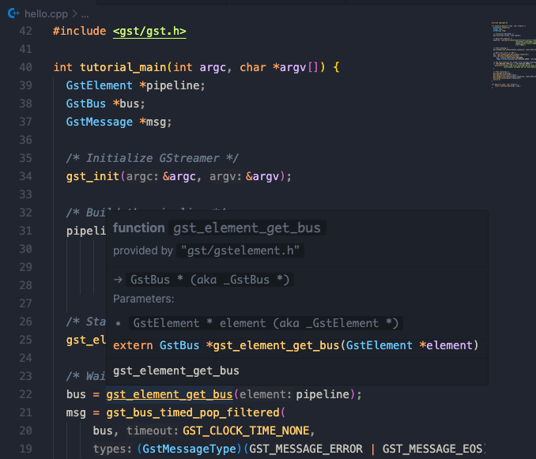

# Environment setup instruction for C++ gstreamer development in VSCode

This is the instruction to setup your vscode like...



## Package installation

### Install Gstreamer library

Please follow the [installation manual](https://gstreamer.freedesktop.org/documentation/installing/index.html?gi-language=c) for your platform.

On debian based Linux, install gstreamer with

```bash
sudo apt-get install libgstreamer1.0-dev libgstreamer-plugins-base1.0-dev \
    libgstreamer-plugins-bad1.0-dev gstreamer1.0-plugins-base \
    gstreamer1.0-plugins-good gstreamer1.0-plugins-bad gstreamer1.0-plugins-ugly \
    gstreamer1.0-libav gstreamer1.0-tools gstreamer1.0-x gstreamer1.0-alsa \
    gstreamer1.0-gl gstreamer1.0-gtk3 gstreamer1.0-qt5 gstreamer1.0-pulseaudio
```

On linux, check if gstreamer library is ready by

```bash
pkg-config --cflags --libs gstreamer-1.0
```

and should see something like

```bash
-pthread -I/usr/include/gstreamer-1.0 -I/usr/include/x86_64-linux-gnu -I/usr/include/glib-2.0 -I/usr/lib/x86_64-linux-gnu/glib-2.0/include -lgstreamer-1.0 -lgobject-2.0 -lglib-2.0
```

which concludes the include paths and linking libraries during the gstreamer plugins compilation.

### Install cmake

Please download and install [cmake](https://cmake.org/download/).

## Setup VSCode

### Install VSCode extensions

Install the following extensions, they will work together to empower VSCode to give us the full development experience.

* [clangd](https://marketplace.visualstudio.com/items?itemName=llvm-vs-code-extensions.vscode-clangd)
* [CMake tools](https://marketplace.visualstudio.com/items?itemName=ms-vscode.cmake-tools)
* [CMake Language Support](https://marketplace.visualstudio.com/items?itemName=josetr.cmake-language-support-vscode)

> [!NOTE]
> If `clangd` extension wants to install any additional packages, please accept the request.

### Setup Cmake

Cmake automates the building (compilation) process and empowers Clangd, the base of our C language server, to work perfectly to make the language hint identical to that when we compile the project.

To begin with, please create the `CMakeLists.txt` file for cmake to generate helper files for compilation.

> [!NOTE]
> Please replace the following parts
> * `<PROJECT>` to your project name
> * `<MAIN.cpp>` to your main C++ file
> * `<EXEC>` to your executable file name

```cmake
# in CMakeLists.txt
cmake_minimum_required(VERSION 3.10)
project(<PROJECT>)

find_package(PkgConfig REQUIRED)
pkg_check_modules(GST REQUIRED gstreamer-1.0)

add_executable(<EXEC> <MAIN.cpp>)
target_include_directories(<EXEC> PRIVATE ${GST_INCLUDE_DIRS})
target_link_libraries(<EXEC> PRIVATE ${GST_LIBRARIES})
target_compile_options(<EXEC> PRIVATE ${GST_CFLAGS_OTHER})
```

After that, you can build the project using VSCode Cmake extension by open vscode prompt (`Ctrl + Shift + P` and type `cmake build`). This process will be conducted automatically every time you open a Cmake project as VSCode working directory.

### Setup Clangd

To setup `clangd` in your workspace, please add the `.clangd` file with the following content.

```bash
CompileFlags:
  Add: [-Wall, -Wextra, -Wpedantic]
```

## Check whether it works

After all the setup steps, please ***REOPEN VSCODE*** to adapt them!!!

After reopen, you should have full Gstreamer language support in VSCode.


